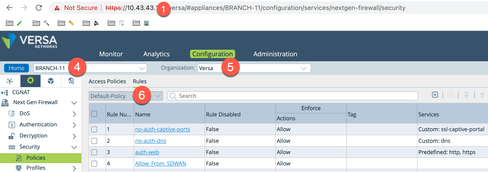

## Purpose of the script
The script will inspect every access rules for a given CPE on Versa Director and execute one of the actions below :

1) display           : Display the rule name
2) set.log           : Set logging on the rule 
3) set.log.profile   : Set a log profile on the rule
4) set.rule.disable  : Disable the rule
5) set.rule.enable   : Enable the rule
6) set.tag:XXX       : Tag the rule with the value XXX
7) delete            : Delete the rule

In addition the script can execute those action for a subset of the existing rules based on a filter such as:

1) has.no.log           : Match rules with no log settings
2) has.log              : Match rules with log settings
3) has.no.log.profile   : Match rules with no log-profile settings
4) has.log.profile      : Match rules if a log-profile exist
5) is.enable            : Match enabled rules
6) is.disable           : Match disabled rules
7) has.tag:XXX          : Match rules with the tag value XXX
8) has.action.allow     : Match rules with the action allow')
9) has.zone.src:XXX     : Match rules with the source zone XXX')
10) has.zone.dst:XXX    : Match rules with the destination zone XXX')
11) none                : Match any rules

## Installation and Dependencies
You will need python3 as well as differents python package. They can be installed locally with pip3
```
pip3 install json
pip3 install requests
pip3 install urllib3
pip3 install argparse
```

## How does it work ?
Before you get started make sure you have the following information:
1) The IP address of the Director where the CPE is managed.
2) The Director Administrator login ( Default is Administrator)
3) The Director Administrator password ( Default is versa123 )
4) The name of the CPE where the change ( or rule review ) is required.
5) The name of the organization where the CPE is managed
6) The name of the Access Policy group where the rules are located ( Default is Default-Policy )



One you have the settings above, you can use the script following the instruction in the Example section.

##  Example
I'm putting below a couple of interresting examples to perform mass changes on VOS access policies. 
Note that by default, ```--user=Administrator``` and  ```--password=versa123```. Make sure you change those variable if required.
   
Display every rules from the CPE BRANCH-11 where log-profile are missing.
```
# python3 access-rules-edit.py --ip 10.43.43.254 --device BRANCH-11 --org Versa --group Default-Policy --action display --filter has.no.log.profile
```

Set log on each rules from the CPE BRANCH-11 but only if logging is not set.
```
#python3 access-rules-edit.py --ip 10.43.43.254 --device BRANCH-11 --org Versa --group Default-Policy --action set.log --filter has.no.log.profile
```

Set the default log profile on each rules from the CPE BRANCH-11 but only if the log-profile is missing.
```
#python3 access-rules-edit.py --ip 10.43.43.254 --device BRANCH-11 --org Versa --group Default-Policy --action set.log.profile --filter has.no.log.profile
```

Delete all disabled rules from the CPE BRANCH-11 .
```
#python3 access-rules-edit.py --ip 10.43.43.254 --device BRANCH-11 --org Versa --group Default-Policy --action delete --filter is.disable
```

## How to use the Help command
You can execute the script with the help flag at different level to help you the syntax.
```
% python3 access-rules-edit.py --help
usage: rules-edit.py [-h] [--ip IP] [--device DEVICE] [--org ORG] [--group GROUP] [--user USER] [--password PASSWORD] [--action ACTION] [--filter FILTER]

Script to change the settings of a VOS CPEs accross ALL its access policies

optional arguments:
  -h, --help           show this help message and exit
  --ip IP              IP address of Director (default: 10.43.43.254)
  --device DEVICE      Branch Device name (default: BRANCH)
  --org ORG            Organization name (default: Versa)
  --group GROUP        Policy Group Name (default: Default-Policy)
  --user USER          GUI username of Director (default: Administrator)
  --password PASSWORD  GUI password of Director (default: versa123)
  --action ACTION      Action to be taken on the offending rules. Use --action help for details (default: display)
  --filter FILTER      Filter to be applied to limit the scope of the action. Use --filter help for details (default: none)

sly@MacBook versa-policy % python3 access-rules-edit.py --action help

display           : Display the rule name
delete            : Delete the rule
set.log           : Set traffic logging on the rule 
set.log.profile   : Set a traffic log profile on the rule
set.rule.disable  : Disable the rule
set.rule.enable   : Enable the rule
set.tag:XXX       : Override the rule tags with the tag value XXX

sly@MacBook versa-policy % python3 access-rules-edit.py --filter help

has.no.log           : Match rules with no log settings
has.log              : Match rules with log settings
has.no.log.profile   : Match rules with no log-profile settings
has.log.profile      : Match rules if a log-profile exist
has.tag:XXX          : Match rules with the tag value XXX
is.enable            : Match enabled rules
is.disable           : Match disabled rules
none                 : Match any rules
```